# WordRush — Full Product & Technical Plan
## Adaptive Vocabulary Game for Kids Inspired by High‑Q BrainWash

**Version:** 1.0  
**Status:** Product & Engineering Blueprint  
**Target:** Hebrew-speaking children learning English  
**Primary Platform:** iOS and Android mobile app  
**Initial Stack:** Expo React Native + TypeScript  
**Scale Target:** 10,000+ vocabulary items, multiple children per family

---

# 1. Executive Summary

WordRush is a vocabulary-learning game designed to make children repeatedly retrieve, recognize, hear, understand, and use English words without feeling like they are studying.

The core principle is simple:

> Build a memory engine first, then hide it inside a game.

The learning loop is inspired by the strongest ideas behind High‑Q's BrainWash-style vocabulary learning:

- repeated exposure;
- bidirectional recall;
- quick recognition;
- increasing retrieval difficulty;
- adaptive repetition;
- reducing repetition for mastered words;
- increasing repetition for weak or confused words;
- short, high-frequency sessions.

WordRush extends this with:

- modern spaced repetition;
- per-skill mastery;
- image-based learning;
- audio;
- speech practice;
- adaptive difficulty;
- AI-generated examples and stories;
- gamification;
- parent analytics;
- thousands of words;
- multiple child profiles;
- offline-first mobile support.

The first release should feel extremely simple to the child:

1. Open the app.
2. Press **Play**.
3. Learn for 5 minutes.
4. Earn XP.
5. Progress through a world.
6. Come back tomorrow.

All learning complexity stays invisible.

---

# 2. Product Vision

## Product promise

**5 minutes a day. Thousands of words over time.**

The child should feel that they are playing a fast mobile game.

The parent should see measurable vocabulary growth.

The system should continuously answer:

- What words does this child know?
- What words are weak?
- What words are being forgotten?
- Which words are being confused?
- What should appear next?
- Which learning modality is weakest?
- How much new material can safely be introduced?

---

# 3. Product Goals

## Primary goals

1. Build durable English vocabulary.
2. Make daily practice short enough to sustain.
3. Adapt automatically to each child.
4. Support thousands of vocabulary items.
5. Avoid boring repetition.
6. Provide parents with useful visibility without requiring manual management.

## Secondary goals

- improve listening recognition;
- improve contextual understanding;
- improve spelling;
- gradually improve pronunciation;
- improve reading speed;
- build confidence.

## Non-goals for V1

Do not make V1 into:

- a full grammar course;
- a school LMS;
- a Duolingo clone;
- a large multiplayer game;
- an AI chat tutor;
- a social network;
- a content-creation platform.

V1 must remain focused on vocabulary retention.

---

# 4. Target Users

## Primary child profiles

### Young learner
- Age: 6–8
- Reads simple English
- Needs high visual support
- Short attention span
- Strong benefit from image/audio

### Developing learner
- Age: 8–11
- Can read English sentences
- Can handle spelling and context
- Ready for larger vocabulary sets

### Advanced child learner
- Age: 10–13
- Comfortable reading
- Can learn abstract vocabulary
- Can use English-only clues later

---

# 5. Core Learning Principles

WordRush should be based on the following principles.

## 5.1 Retrieval over passive exposure

Exposure is useful only at the beginning.

The system should quickly move from:

> see the answer

to:

> retrieve the answer

---

## 5.2 Spaced repetition

Words should return shortly after first learning and then at increasing intervals.

Example:

```text
First exposure
↓
30 seconds
↓
5 minutes
↓
1 day
↓
3 days
↓
7 days
↓
14 days
↓
30 days
↓
90 days
```

The actual interval should be adaptive.

---

## 5.3 Multiple retrieval directions

A child who knows:

```text
APPLE → תפוח
```

does not necessarily know:

```text
תפוח → APPLE
```

Therefore the system must separately test:

- English → Hebrew
- Hebrew → English
- Audio → meaning
- Image → English
- English → image
- English → contextual use
- Spelling
- Pronunciation

---

## 5.4 Interleaving

Do not present words in predictable blocks.

Instead mix:

- old words;
- new words;
- weak words;
- strong words;
- confusable words;
- different categories.

---

## 5.5 Desirable difficulty

A question should be difficult enough to require recall but not so difficult that the child repeatedly fails.

Target success rate:

```text
75%–90%
```

---

# 6. Core Game Loop

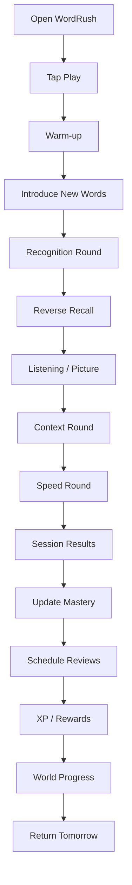

---

# 7. Five-Minute Session Design

A default session should target approximately 5 minutes.

## Suggested composition

```text
0:00–0:30  Warm-up
0:30–1:15  Discover
1:15–2:10  English → Hebrew
2:10–3:00  Hebrew → English
3:00–3:40  Audio / Image
3:40–4:20  Context
4:20–4:50  Speed round
4:50–5:00  Results
```

A session should contain approximately:

```text
12–20 active words
5–8 new words maximum
```

---

# 8. Session Word Selection

Recommended distribution:

```text
40% review due now
25% weak words
20% new words
10% confused words
 5% mastered surprise review
```

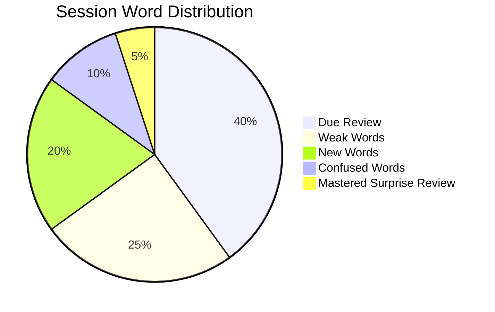

---

# 9. Learning Modes

## 9.1 Discover

First exposure.

Display:

- English word;
- Hebrew meaning;
- image;
- audio;
- optional example sentence.

Example:

```text
APPLE

🍎

תפוח

🔊 apple

The apple is red.
```

Do not overload the screen.

---

## 9.2 English → Hebrew

Question:

```text
APPLE
```

Answers:

```text
תפוח
כלב
בית
גשם
```

---

## 9.3 Hebrew → English

Question:

```text
תפוח
```

Answers:

```text
APPLE
HOUSE
RAIN
DOG
```

---

## 9.4 Audio Match

Play audio.

The child chooses:

- text;
- image;
- translation.

---

## 9.5 Picture Match

Show image.

Choose English word.

---

## 9.6 Context Challenge

Example:

```text
I ate an ___ after lunch.

APPLE
CHAIR
ROAD
WINDOW
```

---

## 9.7 Typing Recall

Later-stage skill.

Prompt:

```text
תפוח
```

Child types:

```text
apple
```

---

## 9.8 Pronunciation

Future version.

The child says the word.

The result becomes a pronunciation skill score.

It should not reduce general vocabulary mastery aggressively.

---

# 10. Mastery Model

Each word has an overall mastery score from 0 to 100.

```text
0–19    New
20–39   Learning
40–59   Familiar
60–79   Strong
80–94   Mastered
95–100  Permanent
```

## Important

The visible mastery score is only the simplified UI representation.

Internally, mastery should be multidimensional.

---

# 11. Skill-Specific Mastery

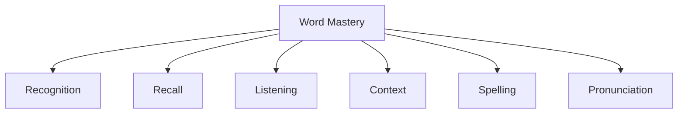

Recommended skill dimensions:

```text
recognition
reverseRecall
listening
context
spelling
pronunciation
```

Overall mastery can be derived from weighted values.

Example:

```text
recognition      20%
reverse recall   25%
listening        20%
context          20%
spelling         10%
pronunciation     5%
```

Weights may vary by age.

---

# 12. Mastery Update Rules

Example initial scoring:

```text
Correct < 1.5 sec       +8
Correct < 3 sec         +6
Correct < 6 sec         +4
Correct slow            +2

Wrong                  -5
Second wrong           -7
Hint used              -2
Skip                   -3
```

Skill-specific bonuses:

```text
Listening correct       +4 listening
Context correct         +5 context
Typed recall            +7 recall/spelling
Pronunciation pass      +3 pronunciation
```

Do not allow a word to become permanently mastered in one session.

---

# 13. Long-Term Mastery Requirement

Example progression:

```text
Day 1    55%
Day 2    68%
Day 4    77%
Day 8    86%
Day 18   94%
Day 45   98%
```

A word should require success across multiple days.

---

# 14. Forgetting Model

Mastery should decay gradually when a word is not reviewed.

Example concept:

```text
effectiveMastery =
storedMastery - forgettingPenalty
```

Where forgettingPenalty depends on:

- time since review;
- word difficulty;
- historical failure rate;
- number of successful reviews;
- child-specific retention rate.

---

# 15. Review Scheduling

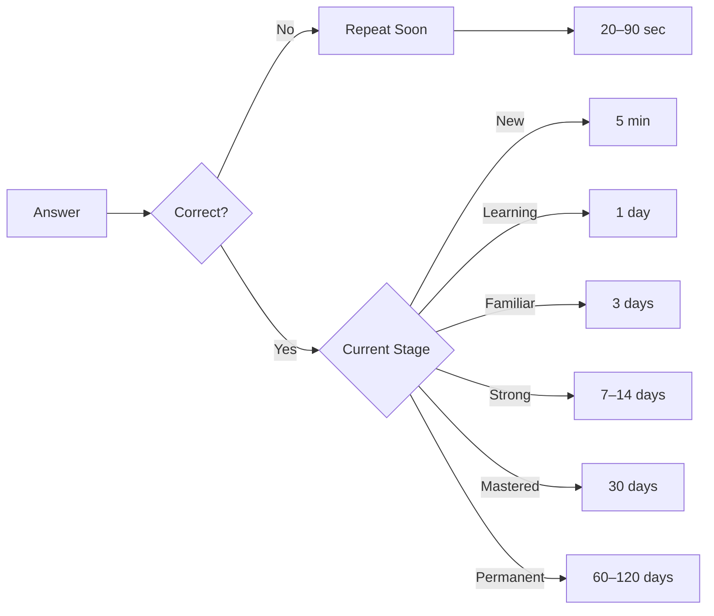

---

# 16. Adaptive Scheduler

The next review date should not be fixed.

Pseudo logic:

```ts
function calculateNextReview(word, result, user) {
  const difficulty = word.difficulty;
  const mastery = word.mastery;
  const speed = result.responseTime;
  const accuracyHistory = word.accuracyHistory;
  const retention = user.retentionProfile;

  if (!result.correct) {
    return soon(20, 90);
  }

  return adaptiveInterval({
    mastery,
    difficulty,
    speed,
    accuracyHistory,
    retention
  });
}
```

---

# 17. Confusion Engine

This is a major differentiator.

If the child repeatedly confuses:

```text
ship
sheep
```

the system should detect a confusion relationship.

---

## Detection

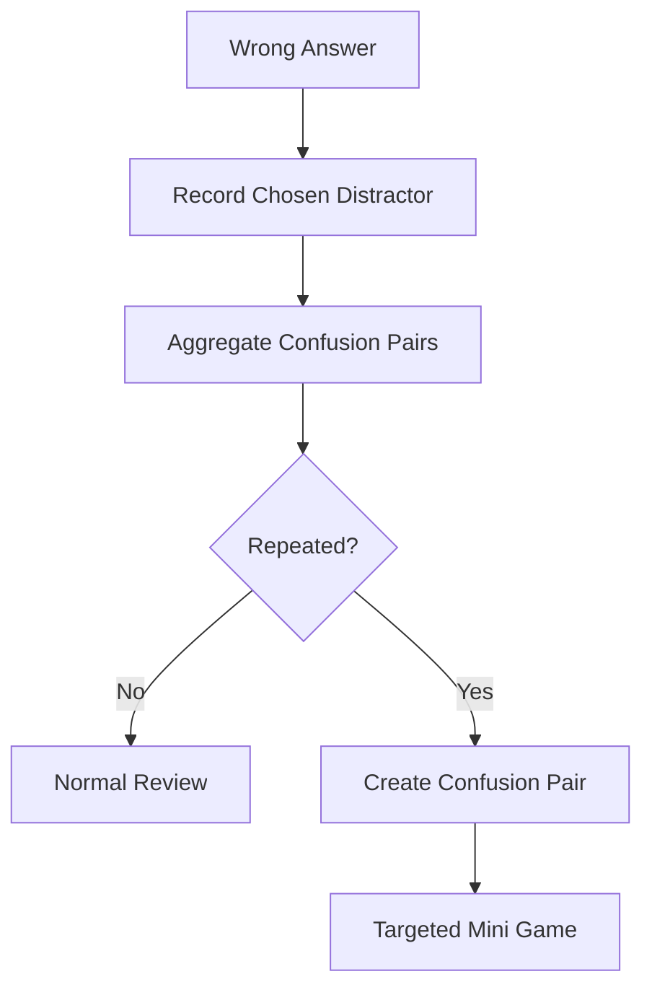

---

## Targeted mini game

```text
🔊 SHEEP

🐑      🚢
```

or:

```text
Which word means כבשה?

SHEEP
SHIP
```

---

# 18. Child Difficulty Model

Each child receives a hidden learning profile.

Example:

```ts
interface LearnerProfile {
  retentionRate: number;
  preferredSessionLength: number;
  readingSpeed: number;
  listeningStrength: number;
  recallStrength: number;
  averageResponseTime: number;
  frustrationThreshold: number;
}
```

The profile changes automatically.

---

# 19. Frustration Control

The app must avoid a failure spiral.

If the child misses several answers:

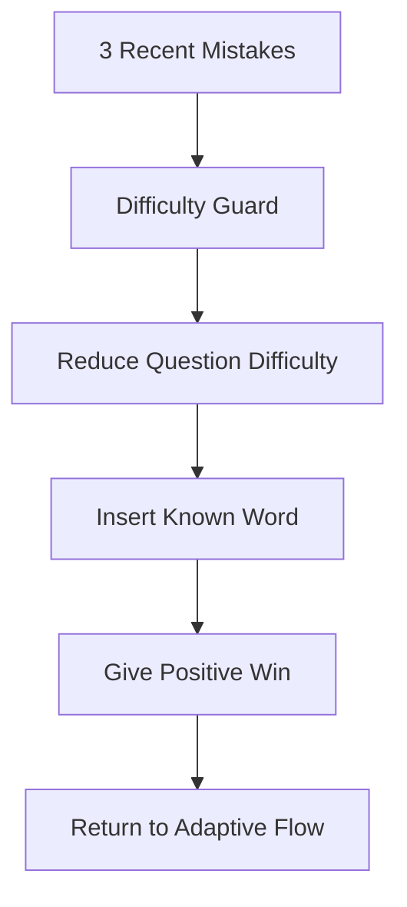

---

# 20. Word Database

Design from day one for 10,000+ vocabulary items.

Example schema:

```ts
interface Word {
  id: string;

  english: string;
  hebrew: string;

  pronunciationIPA?: string;

  audioUS?: string;
  audioUK?: string;

  imageUrl?: string;

  difficulty: number;
  frequencyRank?: number;

  minAge?: number;
  maxAge?: number;

  cefr?: "A1" | "A2" | "B1" | "B2" | "C1";

  categoryIds: string[];

  examples: ExampleSentence[];

  synonyms: string[];
  antonyms: string[];

  confusableWordIds: string[];

  tags: string[];
}
```

---

# 21. User Progress Data

```ts
interface WordProgress {
  childId: string;
  wordId: string;

  mastery: number;

  recognitionScore: number;
  recallScore: number;
  listeningScore: number;
  contextScore: number;
  spellingScore: number;
  pronunciationScore: number;

  seenCount: number;
  correctCount: number;
  wrongCount: number;

  averageResponseMs: number;

  streak: number;

  lastSeenAt: string;
  nextReviewAt: string;

  stage:
    | "new"
    | "learning"
    | "familiar"
    | "strong"
    | "mastered"
    | "permanent";
}
```

---

# 22. Database Model

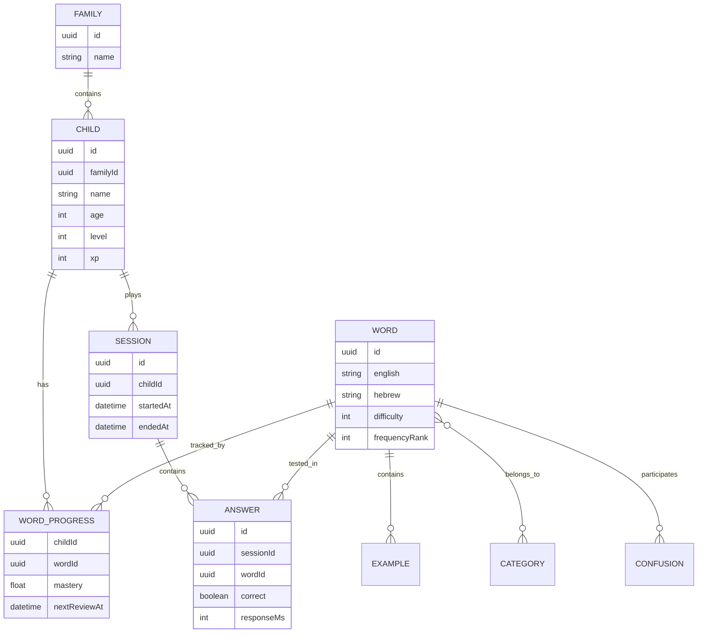

---

# 23. Content Structure

Recommended hierarchy:

```text
Vocabulary
├── Everyday
│   ├── Home
│   ├── Food
│   ├── Clothes
│   └── School
│
├── Living World
│   ├── Animals
│   ├── Plants
│   └── Nature
│
├── Actions
│   ├── Basic Verbs
│   ├── Movement
│   └── Communication
│
├── Description
│   ├── Colors
│   ├── Size
│   ├── Feelings
│   └── Personality
│
├── Time & Place
├── Science
├── Technology
├── Travel
└── Advanced Vocabulary
```

---

# 24. Vocabulary Release Strategy

## Stage 1

Start with:

```text
1,000 high-value words
```

Goals:

- validate gameplay;
- validate learning;
- validate scheduler;
- validate child engagement.

## Stage 2

Expand to:

```text
3,000 words
```

## Stage 3

Expand to:

```text
5,000 words
```

## Stage 4

Expand to:

```text
10,000+ words
```

---

# 25. Word Quality Pipeline

Every word should pass validation.

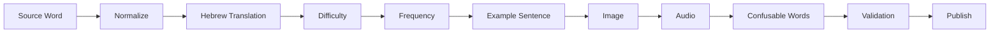

---

# 26. Gamification

The learning engine drives the game.

The game never drives the learning engine.

---

## XP

Example rewards:

```text
Correct answer          +5 XP
Fast answer             +2 XP
Perfect round          +20 XP
Mastered word          +25 XP
Daily session          +30 XP
Boss victory          +100 XP
```

---

# 27. Worlds

Suggested progression:

```text
🌱 World 1 — First Words
🏠 World 2 — My World
🌳 World 3 — Explorer
🚀 World 4 — Adventure
🏰 World 5 — Word Master
🐉 World 6 — Word Legend
🌌 World 7 — English Universe
```

---

# 28. World Progression

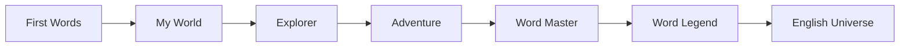

---

# 29. Boss Battles

Every major learning milestone unlocks a boss.

Rules:

```text
20 questions
3 hearts
No new words
Mixed learning modes
```

Example:

```text
❤️ ❤️ ❤️

Question 1 / 20

🔊 "forest"

🌲   🏰   🚗   🌊
```

Boss battles are review sessions disguised as events.

---

# 30. Reward System

Possible rewards:

- stars;
- XP;
- badges;
- character skins;
- map decorations;
- collectible creatures;
- treasure chests;
- streak rewards.

Avoid:

- loot-box-like monetization;
- gambling mechanics;
- excessive timers;
- manipulative pressure.

---

# 31. Parent Dashboard

The parent should see useful learning data.

Example:

```text
Neria

Vocabulary discovered        743
Vocabulary mastered          418
New this week                 62

Accuracy                     89%
Current streak                11 days

Strongest skill:
Listening

Weakest skill:
Reverse recall

Weak words:
between
through
quiet
enough
```

---

# 32. Parent Analytics

Key metrics:

```text
Words discovered
Words mastered
Words weakening
Weekly learning minutes
Weekly new words
Accuracy
Response speed
Retention rate
Listening mastery
Recall mastery
Spelling mastery
Current streak
```

---

# 33. Forgotten Words

Create a specific report.

Example:

```text
Previously mastered but weakening:

before     71%
quiet      68%
through    61%
```

Parent can trigger:

```text
Practice Weak Words
```

---

# 34. AI Layer

AI should enhance content, not control the core learning algorithm.

---

## AI use cases

### Personalized examples

Base word:

```text
castle
```

Normal sentence:

```text
The castle is very old.
```

Personalized version:

```text
The dragon is flying over the castle.
```

---

## AI stories

Weekly story built from recently learned words.

Words:

```text
forest
castle
sword
brave
escape
enemy
```

Generated story uses all of them.

---

## AI safety rule

AI-generated learning content should be:

- age-appropriate;
- filtered;
- deterministic enough for review;
- cached;
- validated where possible.

Do not generate new AI content during every answer screen.

---

# 35. Audio Strategy

Every word should support:

```text
US pronunciation
UK pronunciation
Normal speed
Slow speed
```

V1 may initially use one accent.

Audio should be cached for offline use.

---

# 36. Speech Recognition

Future flow:

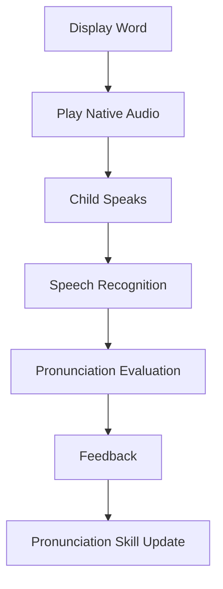

Do not over-penalize pronunciation.

---

# 37. UX Principles

## Child-facing UI

Must be:

- extremely simple;
- large buttons;
- highly visual;
- responsive;
- limited text;
- animated but not distracting.

Every screen should answer one question:

> What do I do now?

---

# 38. Navigation

Recommended child navigation:

```text
Home
Play
World
Collection
Profile
```

Do not add large menu systems.

---

# 39. Home Screen

Primary CTA:

```text
▶ PLAY
```

Secondary:

```text
🔥 7 day streak
⭐ Level 12
🏆 320 words mastered
```

Everything else is secondary.

---

# 40. Animation

Use animation for:

- answer feedback;
- XP;
- progress;
- unlocks;
- world movement;
- boss battles.

Avoid animation that slows learning.

Recommended target:

```text
60 FPS
```

---

# 41. Haptics

On supported phones:

```text
Correct    light tap
Wrong      subtle double tap
Level up   success vibration
Boss win   celebration sequence
```

---

# 42. Mobile App Architecture

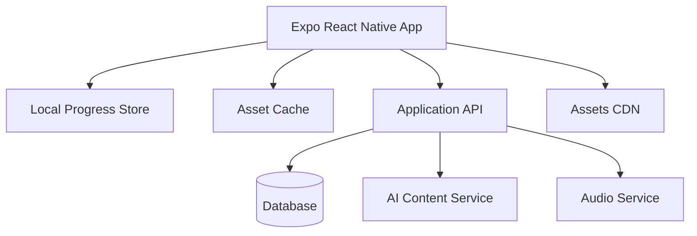

---

# 43. Recommended Technical Stack

## Frontend

```text
Expo React Native
TypeScript
React Navigation
TanStack Query
Zustand or Redux Toolkit
React Native Reanimated
Expo AV
Expo Haptics
```

## Styling

Recommended:

```text
React Native StyleSheet
or
NativeWind
```

Keep the design system small.

---

# 44. Backend

Possible options:

### Option A — Supabase

Strong choice for initial development.

```text
PostgreSQL
Auth
Storage
Edge Functions
Realtime
```

### Option B — Node backend

```text
Node.js
Fastify / Express
PostgreSQL
Redis
```

For V1, Supabase can reduce development effort significantly.

---

# 45. Offline Architecture

The child should be able to continue playing without internet.

Cache:

```text
Current learning set
Upcoming review words
Word images
Audio
Progress queue
```

When connection returns:

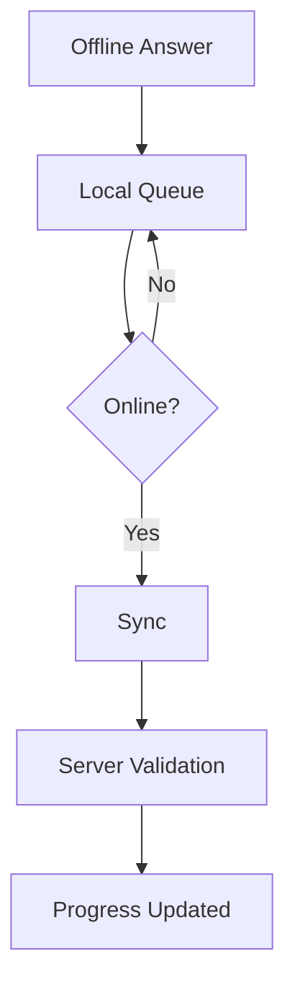

---

# 46. Local-First Session Model

During gameplay:

```text
Do not wait for API calls.
```

Record answers locally.

Batch-sync them after the round.

This keeps gameplay smooth.

---

# 47. Performance Targets

```text
Initial load             < 2 seconds
Question transition      < 100 ms
Answer feedback          < 50 ms
Animation                60 FPS
Offline session          fully playable
```

---

# 48. Security & Child Privacy

Because the application is for children:

- collect minimal personal information;
- no public child profiles;
- no location tracking;
- no advertising profiles;
- no chat with strangers;
- no unnecessary analytics IDs;
- parental control for accounts;
- protected parent dashboard.

---

# 49. Analytics

Track product events such as:

```text
session_started
session_completed
word_shown
answer_submitted
word_mastered
word_forgotten
boss_started
boss_completed
streak_extended
```

Learning data should remain separate from marketing analytics.

---

# 50. Application Modules

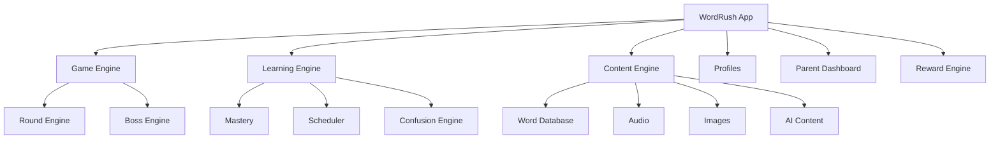

---

# 51. Frontend Folder Structure

Example:

```text
src/
├── app/
├── assets/
├── components/
├── design-system/
├── features/
│   ├── game/
│   ├── session/
│   ├── vocabulary/
│   ├── progress/
│   ├── worlds/
│   ├── rewards/
│   ├── profiles/
│   └── parent-dashboard/
│
├── learning-engine/
│   ├── mastery/
│   ├── scheduler/
│   ├── confusion/
│   └── difficulty/
│
├── services/
├── storage/
├── hooks/
├── types/
└── utils/
```

---

# 52. Learning Engine APIs

Example:

```ts
selectSessionWords(childId): Promise<SessionWord[]>

evaluateAnswer(answer): Evaluation

updateWordMastery(
  progress,
  evaluation
): WordProgress

calculateNextReview(
  progress,
  evaluation
): Date

detectConfusions(
  history
): ConfusionPair[]

buildNextRound(
  sessionState
): Round
```

---

# 53. Session State Machine

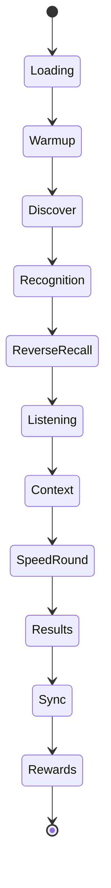

---

# 54. Question Difficulty Model

Difficulty depends on:

```text
word difficulty
child mastery
response history
current session performance
retrieval direction
distractor similarity
time limit
hint availability
```

---

# 55. Distractor Engine

Wrong answers should not be random.

Bad example:

```text
APPLE
תפוח
טלוויזיה
מטוס
מקלחת
```

Better:

```text
APPLE
תפוח
אגס
בננה
תפוז
```

Distractors can come from:

- same category;
- similar spelling;
- similar meaning;
- historical confusion;
- similar pronunciation.

---

# 56. Curriculum Unlocking

Do not expose all words immediately.

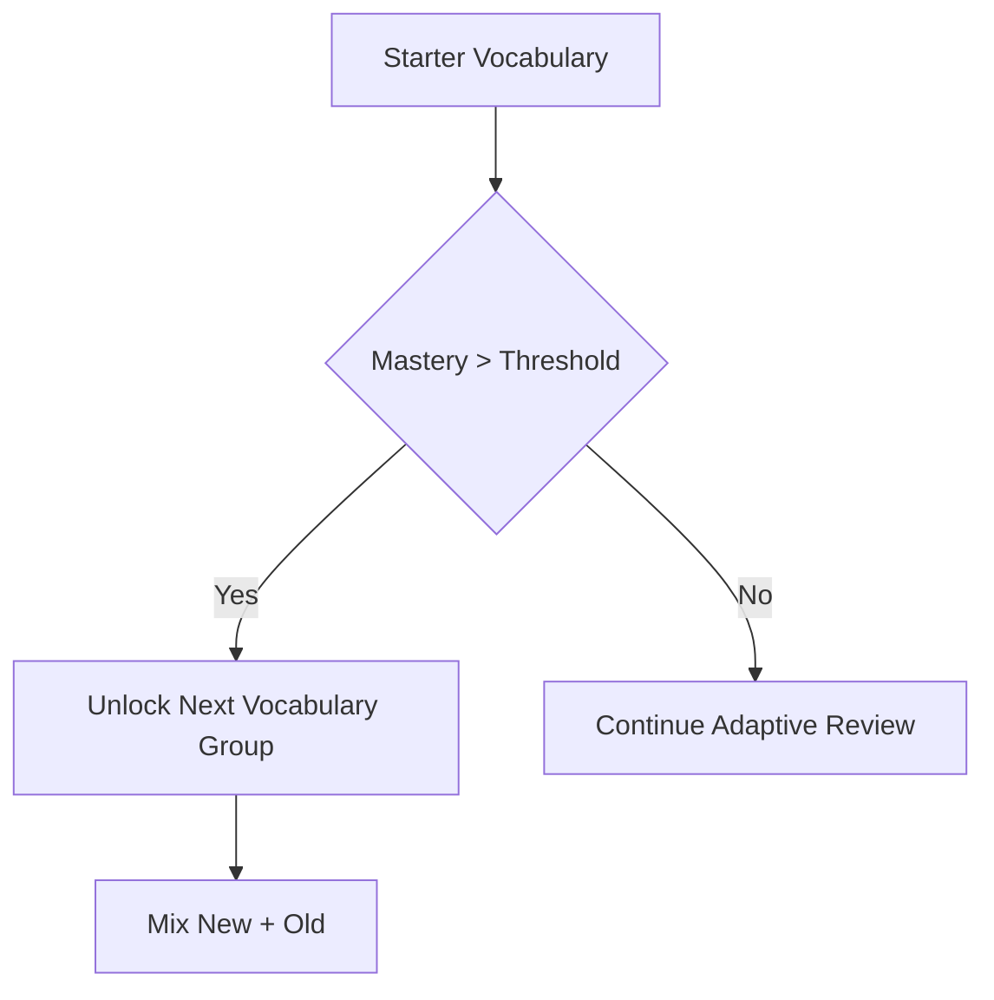

---

# 57. Word Unlock Rules

Possible rule:

```text
New words unlocked if:
- current review load is manageable;
- recent accuracy > 75%;
- no excessive overdue reviews;
- child completed previous unit threshold.
```

---

# 58. Session Safety Limit

If the child has too many reviews due:

```text
Do not add more new words.
```

This prevents backlog.

---

# 59. Streak Design

A streak should reward consistency without creating stress.

Recommended:

```text
1 completed learning session = streak day
```

Allow:

```text
1 grace day per week
```

for children.

---

# 60. Accessibility

Support:

- RTL parent UI;
- LTR English questions;
- large text;
- color-independent feedback;
- audio-first interaction;
- optional dyslexia-friendly font;
- reduced motion mode.

---

# 61. Hebrew / English Layout Rules

The UI must support mixed directions correctly.

Example:

```text
Hebrew UI       RTL
English words   LTR
English sentence LTR
```

Never rely only on page-level direction.

Use explicit:

```css
direction: ltr;
unicode-bidi: isolate;
```

for English content.

---

# 62. MVP Scope

## V1 must include

```text
Child profiles
1,000 words
English ↔ Hebrew
Images
Audio
Discover mode
English → Hebrew
Hebrew → English
Picture match
Listening match
Context questions
Speed round
Mastery engine
Spaced repetition
XP
Levels
Streaks
Basic worlds
Parent dashboard
Offline mobile support
```

---

# 63. V1.5

Add:

```text
3,000 words
Confusion engine
Typing recall
Weak-word practice
Boss battles
Achievements
Improved parent analytics
```

---

# 64. V2

Add:

```text
5,000+ words
Speech recognition
Pronunciation practice
AI examples
AI stories
Adaptive learner profile
More worlds
Collectibles
Advanced spaced repetition
```

---

# 65. V3

Add:

```text
10,000+ words
Reading challenges
Spelling progression
English-only learning mode
Grammar mini-games
Family competitions
Cross-device sync
Teacher mode
```

---

# 66. Development Phases

## Phase 0 — Foundation

Tasks:

- repository setup;
- Expo + React Native + TS;
- React Navigation;
- design tokens;
- local asset loading;
- database schema;
- child profile model.

---

## Phase 1 — Core Vocabulary Engine

Build:

- word schema;
- word importer;
- word progress;
- mastery calculation;
- review scheduler;
- session selection.

Success criterion:

> Engine can choose the correct next 15 words for a child.

---

## Phase 2 — First Game Loop

Build:

- Discover;
- multiple-choice;
- reverse recall;
- answer feedback;
- session results.

Success criterion:

> A child can complete a full 5-minute learning session.

---

## Phase 3 — Media

Add:

- images;
- audio;
- caching;
- preloading.

---

## Phase 4 — Gamification

Add:

- XP;
- levels;
- map/world;
- streaks;
- rewards.

---

## Phase 5 — Parent Dashboard

Add:

- progress;
- weak words;
- forgotten words;
- session history;
- mastery chart.

---

## Phase 6 — Offline

Add:

- service worker;
- local queue;
- offline sessions;
- sync conflict handling.

---

## Phase 7 — Advanced Learning

Add:

- confusion engine;
- context mode;
- typing;
- smarter adaptive scheduling.

---

# 67. Development Roadmap

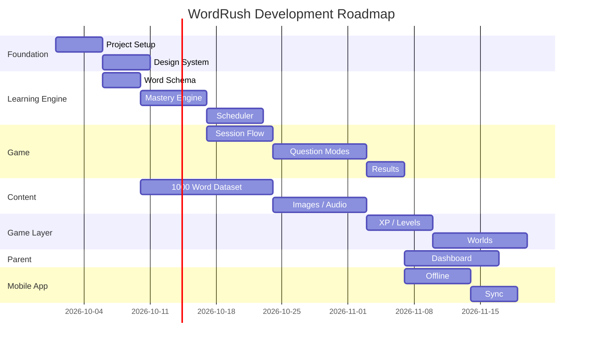

Dates are illustrative and should be adjusted when implementation starts.

---

# 68. Testing Strategy

## Unit tests

Focus on:

```text
mastery calculation
scheduler
session word selection
difficulty adjustment
confusion detection
XP
unlock logic
```

---

# 69. Deterministic Scheduler Tests

Example:

```ts
expect(
  calculateNextReview({
    mastery: 85,
    correct: true,
    responseTime: 1200
  })
).toBeGreaterThan(daysFromNow(7));
```

---

# 70. Game Integration Tests

Test:

```text
Start session
Answer questions
Finish session
Verify mastery
Verify XP
Verify next reviews
Verify saved progress
```

---

# 71. E2E Testing

Use Playwright.

Key journeys:

```text
Create child
Start session
Finish session
Close app
Reopen
Continue progress
Go offline
Complete session
Reconnect
Verify sync
```

---

# 72. Content Validation Tests

Automatically detect:

```text
missing translations
duplicate words
missing audio
missing images
duplicate examples
wrong directionality
broken asset URLs
invalid age level
empty categories
```

---

# 73. Learning Metrics

The product should measure learning success, not only engagement.

Important metrics:

```text
24-hour retention
7-day retention
30-day retention
Mastery stability
Words learned per hour
Words forgotten
Average retrieval speed
Confusion reduction
```

---

# 74. Product Metrics

Also track:

```text
Daily active children
Sessions per week
Average session length
Session completion
Streak continuation
Return after 7 days
Return after 30 days
```

---

# 75. Success Criteria for MVP

MVP should be considered successful if children can:

1. open the app without assistance;
2. understand how to play;
3. complete a 5-minute session;
4. return willingly;
5. show measurable word retention.

Technical goals:

```text
Crash-free sessions > 99.5%
Session completion > 85%
Offline sync success > 99%
Question transitions feel instant
```

---

# 76. First 1,000 Words Strategy

The initial word list should prioritize:

```text
frequency
usefulness
age suitability
concrete concepts
school relevance
home relevance
reading usefulness
```

Approximate allocation:

```text
200 nouns
200 verbs
150 adjectives
100 adverbs
100 function words
100 school/home terms
75 time/location terms
75 nature/animals
```

This can evolve after analyzing real child usage.

---

# 77. Import Pipeline

Create a source file such as:

```text
words.csv
```

Fields:

```text
english
hebrew
difficulty
category
frequencyRank
ageMin
cefr
example
imageKey
audioKey
```

Importer validates and inserts into the DB.

---

# 78. Content Versioning

Word content must be versioned.

Example:

```text
datasetVersion: 1.4.0
```

Needed because translations/examples may change without losing progress.

---

# 79. Deployment

Recommended initial setup:

```text
Frontend:
GitHub Pages / Vercel / Cloudflare Pages

Backend:
Supabase

Assets:
Supabase Storage / CDN
```

If GitHub Pages is used, backend remains external.

---

# 80. CI/CD

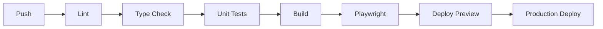

---

# 81. CI Gates

Do not deploy if:

```text
TypeScript fails
Unit tests fail
Critical E2E fails
Vocabulary validation fails
Build exceeds defined bundle threshold
```

---

# 82. Feature Flags

Use feature flags for:

```text
speech
AI stories
boss battles
new scheduler
new game mode
experimental worlds
```

---

# 83. Suggested Repository Structure

```text
wordrush/
├── apps/
│   └── web/
│
├── packages/
│   ├── learning-engine/
│   ├── content/
│   ├── ui/
│   ├── analytics/
│   └── shared/
│
├── data/
│   └── vocabulary/
│
├── scripts/
│   ├── import-words/
│   └── validate-content/
│
├── tests/
└── docs/
```

---

# 84. Future Monorepo Option

If the system grows, migrate to Nx.

Potential projects:

```text
apps/web
apps/admin
apps/api

libs/learning-engine
libs/game-engine
libs/design-system
libs/content
libs/analytics
```

Do not introduce monorepo complexity before necessary.

---

# 85. Admin Tool

Eventually build a simple internal content admin.

Capabilities:

```text
Search words
Edit translation
Change difficulty
Upload image
Replace audio
Edit example
Disable word
Review AI content
See confusion statistics
```

---

# 86. Content QA Dashboard

Show:

```text
Words missing audio
Words missing images
Words with low answer accuracy
Words with unusual confusion rate
Words parents flagged
```

---

# 87. Data Flow

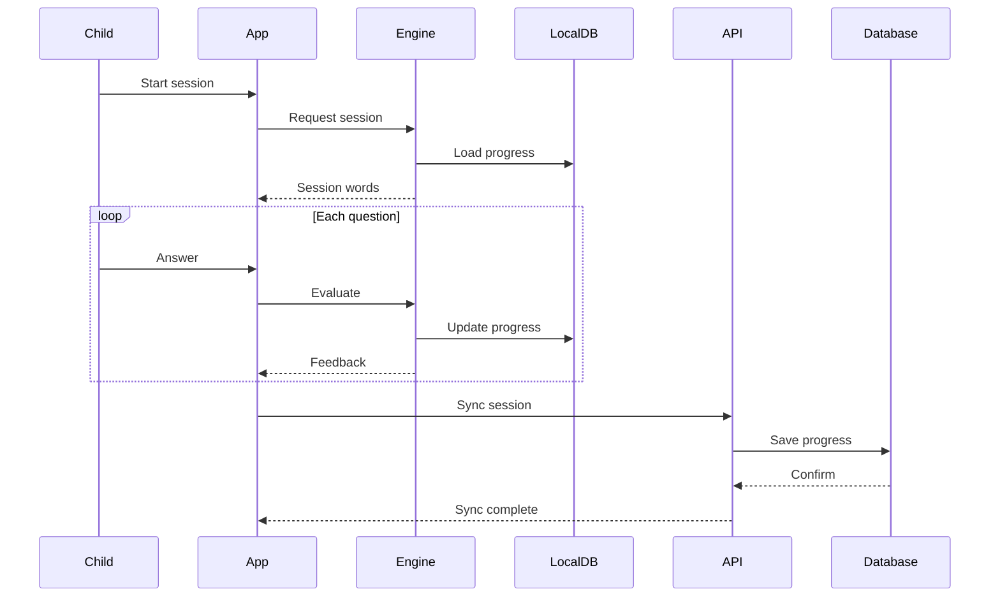

---

# 88. New Word Flow

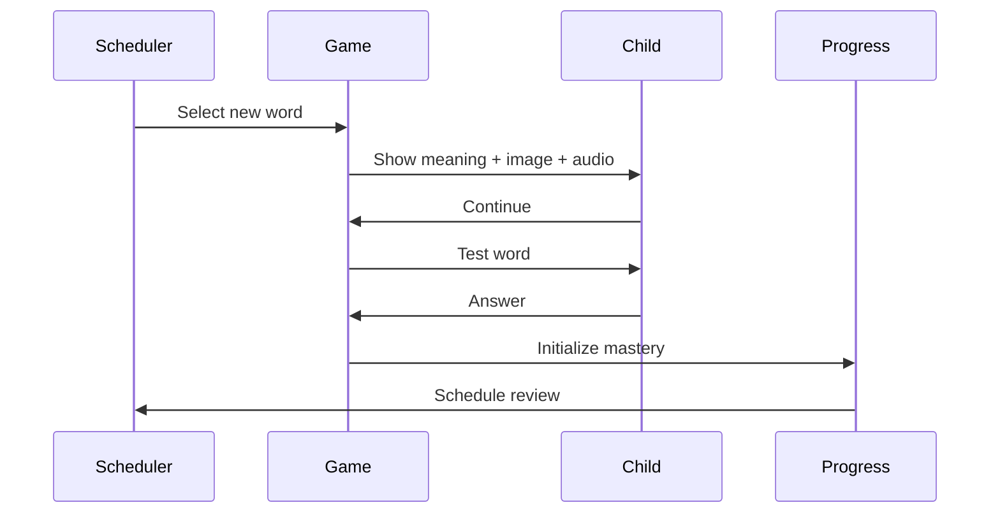

---

# 89. Existing Word Review Flow

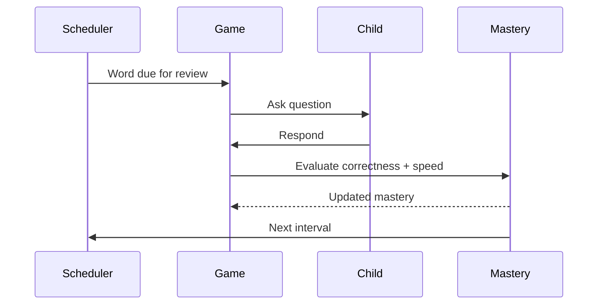

---

# 90. Design Direction

Visual style should feel:

```text
playful
premium
clean
modern
friendly
fast
```

Avoid:

```text
school worksheet feeling
crowded dashboards
too much text
childish baby UI for older children
```

---

# 91. Visual Hierarchy

Every learning screen:

```text
1. Main prompt
2. Answer choices
3. Progress
4. Optional helper
```

No unrelated navigation during active rounds.

---

# 92. Example Game Screen

```text
┌─────────────────────────────┐
│  ⭐ 240 XP       🔥 7       │
│                             │
│           APPLE             │
│            🔊               │
│                             │
│    ┌────────┐ ┌────────┐    │
│    │  תפוח  │ │  תפוז  │    │
│    └────────┘ └────────┘    │
│                             │
│    ┌────────┐ ┌────────┐    │
│    │  אגס   │ │  בננה  │    │
│    └────────┘ └────────┘    │
│                             │
│      ███████░░  7/10        │
└─────────────────────────────┘
```

---

# 93. Results Screen

```text
🎉 Great Job!

⭐ +260 XP
🔥 Streak: 8 days

6 new words
12 strengthened
2 mastered

Accuracy: 91%

[ CONTINUE ]
```

---

# 94. Long-Term Expansion

After vocabulary works well, WordRush can become a broader English platform:

```text
Vocabulary
↓
Reading
↓
Listening
↓
Spelling
↓
Grammar
↓
Speaking
```

But vocabulary remains the foundation.

---

# 95. Product Principle Checklist

Before adding any feature, ask:

```text
Does it improve retention?
Does it improve motivation?
Does it make the app simpler?
Does it provide useful parent insight?
```

If the answer is no to all four, do not build it.

---

# 96. V1 Priority Order

Build in this exact order:

```text
1. Vocabulary data model
2. Child progress model
3. Mastery engine
4. Review scheduler
5. Session selector
6. Basic question screen
7. Discover mode
8. Reverse recall
9. Results screen
10. XP
11. Audio
12. Images
13. Parent dashboard
14. Offline
15. World progression
```

---

# 97. Definition of Done — V1

V1 is done when:

```text
A parent creates a child profile.

The child taps Play.

The system automatically chooses:
- old words;
- weak words;
- due words;
- new words.

The child completes a 5-minute mixed session.

Answers affect mastery.

Review dates are recalculated.

XP is awarded.

Progress is saved.

The app works again tomorrow with the correct next set.

The parent can see meaningful progress.

The session can run offline.
```

---

# 98. Immediate Next Engineering Steps

## Step 1
Create repository.

## Step 2
Build initial architecture.

## Step 3
Create `Word`, `Child`, and `WordProgress` schemas.

## Step 4
Create a seed dataset of 100 words.

## Step 5
Implement mastery calculations.

## Step 6
Implement scheduler.

## Step 7
Implement session word selector.

## Step 8
Build the first complete 5-minute game flow.

## Step 9
Test it with real children.

## Step 10
Expand from 100 → 1,000 words.

---

# 99. Guiding Principle

The most important design rule for the entire project:

> The child should experience a game.  
> The system should experience a learning algorithm.  
> The parent should experience measurable progress.

---

# 100. Final Architecture Overview

```mermaid
graph TB

    CHILD[Child]
    PARENT[Parent]

    APP[WordRush Mobile App]

    GAME[Game Engine]
    LEARNING[Learning Engine]
    CONTENT[Content Engine]
    REWARD[Reward Engine]

    MASTERY[Mastery Engine]
    SCHED[Spaced Repetition]
    CONFUSE[Confusion Engine]
    DIFF[Adaptive Difficulty]

    WORDDB[(Vocabulary Database)]
    PROGRESS[(Progress Database)]
    LOCAL[(Local Offline Store)]

    AUDIO[Audio Assets]
    IMAGE[Image Assets]
    AI[AI Content Layer]

    CHILD --> WEB
    PARENT --> WEB

    WEB --> GAME
    WEB --> LEARNING
    WEB --> CONTENT
    WEB --> REWARD

    LEARNING --> MASTERY
    LEARNING --> SCHED
    LEARNING --> CONFUSE
    LEARNING --> DIFF

    CONTENT --> WORDDB
    CONTENT --> AUDIO
    CONTENT --> IMAGE
    CONTENT --> AI

    LEARNING --> PROGRESS
    WEB --> LOCAL

    LOCAL -.sync.-> PROGRESS
```

---

# 101. Recommended First Milestone

The first milestone should not be "beautiful UI."

It should be:

> **One child can learn 20 English words, close the app, return the next day, and the system intelligently decides exactly what to show next.**

Once that works correctly, everything else becomes a layer on top of a strong foundation.

---

# 102. Suggested Initial Milestone Checklist

```text
[ ] Expo React Native + TypeScript project
[ ] iOS and Android app shell
[ ] Child profile
[ ] 100 seed words
[ ] Word progress
[ ] Mastery engine
[ ] Scheduler
[ ] Session selection
[ ] Discover screen
[ ] Quiz screen
[ ] Reverse quiz
[ ] Session result
[ ] Local persistence
[ ] Basic parent view
[ ] Automated tests
```

---

# 103. Later Enhancement Backlog

Potential future features:

```text
AI-generated stories
Pronunciation coach
Daily quests
Boss battles
Word collections
Family leaderboard
Reading speed mode
Spelling race
Listening-only mode
English-only mode
Word-of-the-day
Parent-created word lists
School word list import
Teacher dashboard
Achievements
Characters
Cosmetics
Seasonal worlds
Offline downloadable packs
Adaptive session duration
Automatic difficulty calibration
Vocabulary placement test
```

---

# 104. Closing Product Statement

WordRush should combine:

```text
BrainWash-style repetition
+
modern spaced repetition
+
adaptive mastery
+
children-first UX
+
game mechanics
+
audio / images
+
AI-enhanced content
```

The result should not feel like homework.

It should feel like a five-minute game that quietly builds thousands of durable English vocabulary connections over months and years.

---

# 105. Asset Inventory & Generation Plan

This section defines the complete production plan for WordRush visual, audio, motion, learning-content, parent-dashboard, and marketing assets.

The asset strategy follows one central rule:

> Generate reusable systems first, learning-critical assets second, decorative assets last.

The application may eventually contain 10,000+ vocabulary items, but asset generation must scale through repeatable batches rather than one massive manual production effort.

---

## 105.1 Asset production principles

Priority order:

```text
1. Assets that directly improve learning
2. Assets that improve clarity/usability
3. Assets that improve motivation
4. Decorative assets
```

Do not generate all vocabulary assets up front.

Scale in validated batches:

```text
100 words
↓
500 words
↓
1,000 words
↓
3,000 words
↓
5,000+ words
↓
10,000+ words
```

Reuse templates and systems wherever possible.

---

# 106. Asset Architecture

```mermaid
graph TD
    A[WordRush Asset System]

    A --> B[Brand]
    A --> C[Mascot]
    A --> D[UI]
    A --> E[Learning Content]
    A --> F[Worlds]
    A --> G[Bosses]
    A --> H[Rewards]
    A --> I[Audio]
    A --> J[Motion / FX]
    A --> K[Parent Dashboard]
    A --> L[Marketing]
```

---

# 107. Brand Assets

| Asset | Qty | Priority | V1? | Format |
|---|---:|---|---|---|
| Primary logo | 1 | P0 | Yes | SVG + PNG |
| Horizontal logo | 1 | P1 | Yes | SVG + PNG |
| Monochrome logo | 2 | P1 | Yes | SVG |
| App icon | 1 | P0 | Yes | PNG 1024×1024 |
| Favicon set | 3–5 | P0 | Yes | PNG/ICO |
| Splash artwork | 1 | P1 | Yes | WebP/PNG |
| Social preview | 1 | P3 | Later | WebP |
| Logo animation | 1 | P3 | Later | Lottie/WebM |

Before mass-generating assets, define:

```text
Primary color
Secondary color
Accent color
Success color
Warning color
Error color
Background palette
Text palette
Border-radius scale
Shadow scale
Spacing scale
Icon stroke rules
Illustration style
Lighting rules
Texture rules
```

Store these rules in:

```text
docs/design/visual-language.md
```

---

# 108. Mascot System

The mascot should provide continuity across learning, onboarding, mistakes, celebrations, rewards, and empty states.

Initial mascot set:

| State | Qty | Priority |
|---|---:|---|
| Neutral | 1 | P0 |
| Happy | 1 | P0 |
| Excited | 1 | P0 |
| Thinking | 1 | P0 |
| Encouraging | 1 | P0 |
| Surprised | 1 | P1 |
| Celebrating | 1 | P1 |
| Sleeping | 1 | P2 |
| Boss outfit | 1 | P2 |
| Seasonal variants | 4–8 | P3 |

Recommended initial batch:

```text
6–8 expressions
```

Technical master:

```text
2048×2048
transparent PNG/WebP
```

Runtime exports:

```text
512×512
256×256
128×128
```

Future animation:

```text
Rive
Lottie
WebM
```

---

# 109. Core UI Asset Set

Prefer vector icons and CSS rather than raster images.

Required initial icons:

```text
Play
Pause
Replay audio
Next
Back
Close
Settings
Home
World
Profile
Parent
Lock
Unlock
Star
XP
Streak
Heart
Crown
Trophy
Check
Wrong
Hint
Skip
Sound
Muted
Image
Keyboard
Microphone
Book
Calendar
Progress
```

Target:

```text
25–35 reusable icons
```

Preferred format:

```text
SVG
```

Required UI states:

```text
default
pressed
disabled
locked
selected
correct
wrong
pending
perfect
mastered
new word
weak word
review due
```

Prefer CSS/component states instead of baking every state into a PNG.

---

# 110. Learning Category Assets

Initial category illustrations:

```text
Animals
Food
Home
School
Body
Clothes
Nature
Actions
Feelings
Colors
Numbers
Time
Travel
Science
Technology
Sports
Weather
Transport
People
Places
```

Initial target:

```text
15–20 category illustrations
```

Preferred:

```text
SVG for simple iconography
WebP for richer illustrations
```

---

# 111. Vocabulary Illustration Strategy

Different word types need different visual treatments.

## Concrete nouns

Examples:

```text
apple
dog
chair
train
```

Use:

```text
one dominant object
simple background
clear silhouette
no text
no secondary distracting object
```

## Actions

Examples:

```text
jump
run
sleep
carry
```

Use:

```text
one character performing one unmistakable action
```

## Adjectives

Examples:

```text
big
small
cold
angry
```

Use comparison/context.

Example:

```text
BIG → large elephant beside a small mouse
```

## Spatial / relational words

Examples:

```text
between
under
above
inside
```

Use diagrams.

Example:

```text
BETWEEN → red ball between two blue boxes
```

## Abstract words

Examples:

```text
although
because
however
before
```

Do not force a decorative image that may misteach the word.

Use:

```text
timeline
relationship diagram
context sentence
micro-animation
paired scenes
```

---

# 112. Vocabulary Image Style Guide

Every vocabulary image must be:

```text
child-friendly
immediately understandable
visually clean
consistent
high contrast
free of unnecessary text
free of logos/watermarks
appropriate for ages 6–12
```

The target concept should be identifiable in:

```text
< 1 second
```

Master size:

```text
1024×1024
```

Runtime:

```text
512×512 WebP
256×256 WebP
```

Suggested limits:

```text
256px image < 100 KB
512px image < 250 KB
```

---

# 113. Vocabulary Asset Batches

## Batch A — First 100 words

Purpose:

```text
Validate illustration style
Validate generation prompts
Validate asset pipeline
Validate child understanding
Validate performance
```

Approximate visual mix:

```text
~70 concrete/object visuals
~15 action visuals
~10 comparison/context visuals
~5 diagrams/abstract visuals
```

## Batch B — 500 words

After Batch A approval:

```text
~350 concrete/action visuals
~100 context/comparison visuals
~50 diagram/abstract treatments
```

## Batch C — 1,000 words

Create the first complete production vocabulary pack only after the style and QA process are stable.

---

# 114. Audio Asset Plan

Audio is a learning-critical asset and should have higher priority than decorative game art.

Every production word should eventually include:

```text
normal pronunciation
slow pronunciation
```

Optional later:

```text
US pronunciation
UK pronunciation
```

Recommended specification:

```text
AAC or MP3
44.1 kHz
mono
clean voice
no music
no reverb
minimal silence
```

Typical duration:

```text
0.5–2 seconds
```

---

# 115. Audio Naming

Human-readable example:

```text
word-apple-us-normal.mp3
word-apple-us-slow.mp3
```

Production should prefer stable IDs:

```text
w-000001-us-normal.mp3
w-000001-us-slow.mp3
```

---

# 116. Game Sound Effects

Initial SFX:

| Asset | Initial Qty | Priority |
|---|---:|---|
| Button tap | 1–2 | P1 |
| Correct answer | 2–3 | P0 |
| Wrong answer | 1–2 | P0 |
| XP gain | 1 | P1 |
| Streak increase | 1 | P1 |
| Word mastered | 1 | P0 |
| Session complete | 1 | P0 |
| Level up | 1 | P1 |
| World unlock | 1 | P1 |
| Chest open | 1 | P2 |
| Boss hit | 2 | P2 |
| Boss victory | 1 | P2 |

Initial target:

```text
12–18 SFX
```

Music is optional for V1.

Potential later loops:

```text
Home
Learning
World map
Boss
Victory
```

Music and pronunciation must have separate volume/mute controls.

---

# 117. World Assets

Each world can contain:

```text
background
world icon
environment decorations
locked treatment
completed treatment
map nodes
boss entrance
treasure/review nodes
```

V1 target:

```text
3 visually complete worlds
```

Long-term:

```text
7 worlds
```

Recommended master background:

```text
2048×2732 portrait
```

Also prepare responsive crops.

---

# 118. World Node System

Reusable states:

```text
locked
available
current
completed
perfect
boss
treasure
review
```

Build these primarily as reusable components.

---

# 119. Boss Assets

Bosses should feel playful rather than frightening.

Potential archetypes:

```text
Sleepy Dragon
Word Goblin
Cloud Giant
Robot Librarian
Magic Owl
```

Per-boss states:

```text
idle
hit
angry
defeated
friendly/celebrating
```

Recommended:

```text
V1: 0–3 bosses
V1.5: 5 bosses
```

Master:

```text
2048×2048 transparent WebP/PNG
```

Do not block V1 on complex boss animation.

---

# 120. Reward & Achievement Assets

Starter achievements:

```text
First Session
7-Day Streak
10 Words Mastered
50 Words Mastered
100 Words Mastered
Perfect Round
Fast Thinker
Listening Star
Spelling Star
Boss Winner
Explorer
Word Master
```

Initial target:

```text
10–15 badges
```

Use a badge system instead of 100 unrelated illustrations:

```text
3 reusable frames
+
central icon
+
rarity decoration
```

Potential rarity:

```text
Bronze
Silver
Gold
Legendary
```

---

# 121. Feedback and FX Assets

Initial feedback effects:

```text
Correct sparkle
Perfect-answer burst
Wrong subtle shake
XP particle
Mastery crown
Level-up burst
Streak pulse
World unlock glow
Boss victory confetti
```

Prefer:

```text
React Native styles
React Native Reanimated
Lottie
Rive
```

rather than large GIFs.

---

# 122. Animation Priority

## P0

```text
answer feedback
progress update
XP gain
word mastered
session completion
```

## P1

```text
streak
world unlock
level up
mascot reaction
```

## P2

```text
boss animation
reward chest
seasonal environment effects
```

Performance target:

```text
60 FPS
```

Avoid animation that delays the next learning interaction.

---

# 123. Parent Dashboard Assets

The parent-facing design should be cleaner and more mature than the child's game UI.

Required assets:

```text
child avatars
no-session empty state
no-weak-words state
forgotten-words state
mastery trophy
weekly summary icon
progress icon
listening icon
recall icon
spelling icon
review-due icon
sync/offline state
```

Initial target:

```text
8–12 dashboard assets
```

---

# 124. Child Avatar System

For V1:

```text
8–12 prebuilt avatars
```

Do not require child photographs.

This reduces:

```text
privacy complexity
storage
moderation concerns
```

A modular avatar builder can be added later.

---

# 125. Empty-State Assets

Create reusable empty states for:

```text
No sessions yet
No weak words
No forgotten words
No achievements
Offline
Sync failed
No audio available
No image available
```

Use the mascot plus a short message.

---

# 126. Marketing Assets

Not required for initial learning validation.

Later:

```text
landing-page hero
App Store / Play Store screenshots
social preview image
feature banner
demo video/GIF
parent-facing product illustration
```

Priority:

```text
P3
```

until the learning loop works well.

---

# 127. Priority Levels

```text
P0 = required for first playable product
P1 = required for polished V1
P2 = V1.5 / enhancement
P3 = later / seasonal / marketing
```

---

# 128. First Playable Asset Scope

P0:

```text
1 primary logo
1 app icon
1 mascot
5–6 mascot expressions
25 core UI icons
15 category icons
100 vocabulary visuals
100 normal pronunciation files
correct feedback
wrong feedback
word-mastered feedback
session-complete feedback
basic world map
3 child avatars minimum
```

---

# 129. Polished V1 Asset Scope

Add:

```text
8 mascot expressions
30–35 UI icons
20 category illustrations
300–500 vocabulary visuals
500 pronunciation assets
3 world backgrounds
10 achievement badges
8–12 avatars
12–18 SFX
parent-dashboard illustration set
reward/feedback FX
```

---

# 130. V1.5 Asset Scope

Add:

```text
1,000 vocabulary visual coverage where useful
1,000+ audio items
5 bosses
boss states
15–25 badges
reward chest
additional world art
typing/spelling visuals
confusion mini-game visuals
advanced FX
```

---

# 131. V2 Asset Scope

Add:

```text
3,000–5,000+ vocabulary assets
dual-accent audio where useful
animated mascot
animated bosses
AI story illustrations
seasonal world variants
speech/pronunciation UI
advanced parent reports
```

---

# 132. Asset Folder Structure

```text
assets/
├── brand/
│   ├── logo/
│   ├── icons/
│   └── splash/
│
├── mascot/
│   ├── static/
│   └── animated/
│
├── ui/
│   ├── icons/
│   ├── badges/
│   ├── states/
│   └── effects/
│
├── worlds/
│   ├── world-01/
│   ├── world-02/
│   └── world-03/
│
├── bosses/
│
├── vocabulary/
│   ├── images/
│   ├── diagrams/
│   └── category-icons/
│
├── audio/
│   ├── words/
│   ├── sfx/
│   └── music/
│
├── avatars/
├── parent/
└── marketing/
```

---

# 133. Naming Convention

Use lowercase kebab-case.

Examples:

```text
logo-primary.svg
app-icon-1024.png
mascot-happy.webp
mascot-thinking.webp
world-01-background.webp
boss-sleepy-dragon-idle.webp
badge-perfect-round.svg
category-animals.svg
fx-word-mastered.json
```

Vocabulary assets should use stable IDs:

```text
w-000001.webp
w-000001-us-normal.mp3
w-000001-us-slow.mp3
```

---

# 134. Asset Metadata

Every generated vocabulary asset should have metadata.

Example:

```json
{
  "wordId": "w-000001",
  "english": "apple",
  "assetType": "illustration",
  "version": 1,
  "styleVersion": "visual-v1",
  "generatedBy": "ai",
  "reviewed": true,
  "createdAt": "2026-10-01"
}
```

---

# 135. Asset Manifest

Create:

```text
data/assets-manifest.json
```

Example:

```json
{
  "w-000001": {
    "image": "/assets/vocabulary/images/w-000001.webp",
    "audioNormal": "/assets/audio/words/w-000001-us-normal.mp3",
    "audioSlow": "/assets/audio/words/w-000001-us-slow.mp3"
  }
}
```

The manifest allows CI and the app to find missing assets automatically.

---

# 136. Asset Generation Workflow

```mermaid
flowchart TD
    A[Asset Requirement] --> B[Design Brief / Prompt]
    B --> C[Generate Draft]
    C --> D[Human Review]
    D --> E{Approved?}
    E -->|No| F[Regenerate / Edit]
    F --> D
    E -->|Yes| G[Optimize]
    G --> H[Rename]
    H --> I[Add Metadata]
    I --> J[Automated Validation]
    J --> K[Commit / Publish]
```

---

# 137. Vocabulary Asset Pipeline

```mermaid
flowchart LR
    A[Word Dataset] --> B[Classify Word]
    B --> C{Concrete?}
    C -->|Yes| D[Object Illustration]
    C -->|No| E{Action / Adjective?}
    E -->|Yes| F[Context Scene]
    E -->|No| G[Diagram / Context Treatment]

    D --> H[Human QA]
    F --> H
    G --> H
    H --> I[Resize + Compress]
    I --> J[Manifest]
    J --> K[Publish]
```

---

# 138. Base AI Image Brief

Every learning-image generation request should inherit this style brief:

```text
Create a clear child-friendly educational illustration for the English word "{WORD}".

Requirements:
- one dominant learning concept
- no written words
- no logos or watermarks
- no visual ambiguity
- suitable for children ages 6–12
- consistent WordRush illustration style
- clear silhouette
- readable at 256×256
- minimal unnecessary background detail
```

Add word-specific context after this base brief.

---

# 139. Abstract Word Visual Briefs

Example:

```text
BETWEEN
Show one red ball clearly positioned between two blue boxes.
Simple educational composition.
No text.
```

Example:

```text
BEFORE
Show a simple two-event visual timeline where one action visibly happens first.
No written labels.
```

For conjunctions such as:

```text
because
although
however
```

prefer context sentences or paired scenes over isolated decorative art.

---

# 140. Image QA Checklist

```text
[ ] Meaning is immediately understandable
[ ] Correct word association
[ ] No embedded text
[ ] No watermark
[ ] No unrelated brand/logo
[ ] No inappropriate content
[ ] No confusing secondary subject
[ ] Style matches WordRush
[ ] Works at 256×256
[ ] Good contrast
[ ] Correct crop
[ ] Age appropriate
```

---

# 141. Audio QA Checklist

```text
[ ] Correct word
[ ] Correct pronunciation
[ ] Clear voice
[ ] No clipping
[ ] No background noise
[ ] No excessive silence
[ ] Correct accent metadata
[ ] Correct normal/slow version
[ ] Correct word ID mapping
```

---

# 142. Boss QA Checklist

```text
[ ] Fun rather than frightening
[ ] Clear mobile silhouette
[ ] Distinct from mascot
[ ] State changes are obvious
[ ] Not overly detailed
[ ] Matches world style
```

---

# 143. UI Asset QA Checklist

```text
[ ] Consistent visual weight
[ ] Consistent icon stroke
[ ] Works on required backgrounds
[ ] No text baked into icon
[ ] SVG optimized
[ ] Meaning is clear
[ ] Does not rely on color alone
```

---

# 144. Automated Asset Validation

CI should detect:

```text
missing files
duplicate filenames
unsupported formats
oversized files
wrong dimensions
broken manifest references
missing required audio
missing required category assets
invalid naming
```

---

# 145. Asset Performance Budgets

Suggested initial limits:

```text
Initial shell assets       < 1.5 MB compressed
World background           < 500 KB
Vocabulary image           < 250 KB
UI SVG                     < 20 KB
Word audio                 < 50 KB average
SFX                        < 100 KB average
```

Lazy-load assets by session/world.

---

# 146. Session Preloading

Before a learning session:

```text
preload current 15–20 word images
preload current word audio
preload feedback SFX
preload next-round assets
```

Do not download the entire vocabulary library.

---

# 147. Offline Asset Packs

Future option:

```text
Download World 1
Download World 2
```

Each pack can include:

```text
vocabulary images
word audio
world artwork
category icons
```

---

# 148. Content Completeness Rules

For every word:

| Content | Requirement |
|---|---|
| English word | Required |
| Hebrew translation | Required |
| Normal audio | Required |
| Slow audio | Preferred |
| Example sentence | Required |
| Category | Required |
| Difficulty | Required |
| Image | Required when educationally useful |
| Confusable words | Optional initially |

---

# 149. Asset Coverage Dashboard

The internal admin dashboard should show:

```text
Total words
Words with visuals
Words with normal audio
Words with slow audio
Words with examples
Words missing assets
Assets awaiting review
Rejected assets
Asset coverage %
```

---

# 150. First 100-Word Production Batch

## Step 1 — Select words

Suggested mix:

```text
40 nouns
25 verbs
15 adjectives
10 spatial/time/function words
10 mixed
```

## Step 2 — Classify visual treatment

```text
object
action
comparison
diagram
context-only
```

## Step 3

Generate visuals.

## Step 4

Generate normal and slow audio.

## Step 5

Run human QA.

## Step 6

Test with actual children.

## Step 7

Fix the style/pipeline before scaling.

---

# 151. 500-Word Production Batch

After the first 100 are validated:

```text
Generate in groups of 50–100 words
```

Track rejection reasons:

```text
ambiguous image
incorrect translation
bad pronunciation
visual inconsistency
child misunderstood image
asset too large
wrong context
```

Do not blindly continue generating if a pattern of failure appears.

---

# 152. 1,000-Word Production Batch

At 1,000 words, the asset workflow must be automated.

Required capabilities:

```text
CSV/JSON input
automatic word classification
prompt generation
batch generation
stable file naming
automatic resize
compression
manifest generation
QA status tracking
missing-asset detection
```

Human educational review remains required.

---

# 153. Asset Lifecycle

Every asset has a status:

```text
planned
generated
review
approved
rejected
optimized
published
deprecated
```

---

# 154. Asset Versioning

Do not silently overwrite production learning assets.

Example:

```text
w-000123-v1.webp
w-000123-v2.webp
```

The manifest points to the active version.

This supports rollback and quality improvements without losing history.

---

# 155. Master V1 Asset Checklist

## Branding

```text
[ ] Primary logo
[ ] Horizontal logo
[ ] App icon
[ ] Favicons
[ ] Splash artwork
[ ] Brand palette
[ ] Typography rules
[ ] Illustration style guide
```

## Mascot

```text
[ ] Neutral
[ ] Happy
[ ] Excited
[ ] Thinking
[ ] Encouraging
[ ] Surprised
[ ] Celebrating
```

## Core UI

```text
[ ] Play
[ ] Pause
[ ] Replay
[ ] Next
[ ] Back
[ ] Close
[ ] Settings
[ ] Home
[ ] World
[ ] Profile
[ ] Parent
[ ] Lock
[ ] Unlock
[ ] Star
[ ] XP
[ ] Streak
[ ] Heart
[ ] Crown
[ ] Trophy
[ ] Correct
[ ] Wrong
[ ] Hint
[ ] Skip
[ ] Sound
[ ] Microphone
[ ] Keyboard
[ ] Progress
```

## Categories

```text
[ ] Animals
[ ] Food
[ ] Home
[ ] School
[ ] Body
[ ] Clothes
[ ] Nature
[ ] Actions
[ ] Feelings
[ ] Colors
[ ] Numbers
[ ] Time
[ ] Travel
[ ] Science
[ ] Technology
```

## Learning Content

```text
[ ] First 100 word visuals
[ ] First 100 normal audio files
[ ] First 100 slow audio files
[ ] First 100 example sentences
[ ] Visual QA
[ ] Audio QA
```

## World / Game

```text
[ ] Base world map
[ ] World 1 background
[ ] World 2 background
[ ] World 3 background
[ ] Map node states
[ ] Correct feedback
[ ] Wrong feedback
[ ] Word mastered effect
[ ] Session complete effect
```

## Rewards

```text
[ ] XP icon
[ ] Streak icon
[ ] Mastery crown
[ ] Trophy
[ ] 10 starter badges
```

## SFX

```text
[ ] Button tap
[ ] Correct
[ ] Wrong
[ ] XP
[ ] Mastered
[ ] Session complete
[ ] Level up
[ ] Unlock
```

## Parent

```text
[ ] 8 child avatars
[ ] No-session state
[ ] No-weak-words state
[ ] Forgotten-words state
[ ] Mastery icon
[ ] Weekly summary icon
```

---

# 156. Master Asset Inventory

| Category | Asset Group | Initial Qty | V1 Priority | Format |
|---|---|---:|---|---|
| Brand | Logo set | 3–5 | P0 | SVG/PNG |
| Brand | App icon | 1 | P0 | PNG |
| Mascot | Expressions | 6–8 | P0 | WebP/PNG |
| UI | Core icons | 25–35 | P0 | SVG |
| Categories | Category art | 15–20 | P0/P1 | SVG/WebP |
| Vocabulary | Word visuals | 100 initial | P0 | WebP |
| Vocabulary | Normal audio | 100 initial | P0 | MP3/AAC |
| Vocabulary | Slow audio | 100 initial | P1 | MP3/AAC |
| Worlds | Backgrounds | 3 | P1 | WebP |
| Worlds | Map node states | 7–8 | P1 | SVG/WebP |
| Bosses | Characters | 0–3 initial | P2 | WebP |
| Rewards | Badges | 10–15 | P1 | SVG/WebP |
| FX | Feedback effects | 5–8 | P0/P1 | CSS/Lottie |
| Audio | Game SFX | 8–12 | P1 | MP3/AAC |
| Parent | Child avatars | 8–12 | P1 | WebP |
| Parent | Dashboard art | 5–8 | P1 | SVG/WebP |
| Marketing | Launch assets | 5–10 | P3 | PNG/WebP |

---

# 157. Recommended Creation Order

```text
1. Visual language
2. Logo + app icon
3. Mascot
4. Core UI icon set
5. Learning-card templates
6. Category assets
7. First 100 vocabulary visuals
8. First 100 pronunciation assets
9. Feedback FX + SFX
10. First world
11. Parent-dashboard assets
12. Additional worlds
13. Bosses
14. Advanced rewards
15. Marketing assets
```

---

# 158. Asset Milestone 1

Complete when:

> WordRush can teach 100 words end-to-end using production-quality branding, visuals, audio, and feedback with no placeholder learning assets.

Do not mass-generate thousands of assets before reaching this milestone.

---

# 159. Asset Milestone 2

Complete when:

```text
500-word learning pack is production ready
visual style is stable
audio pipeline is stable
three worlds are usable
parent dashboard has final visual language
```

---

# 160. Asset Milestone 3

Complete when:

```text
1,000-word content pack is production ready
automated validation exists
asset manifests are complete
batch generation is repeatable
CI validates asset quality
```

---

# 161. Asset Production Diagram

```mermaid
flowchart TD
    A[Product Requirement]
    --> B[Asset Brief]
    --> C[Generate]
    --> D[Human QA]
    --> E{Pass?}
    E -->|No| C
    E -->|Yes| F[Optimize]
    --> G[Metadata + Manifest]
    --> H[CI Validation]
    --> I[Publish]
    --> J[Observe Child Usage]
    --> K{Learning Issue?}
    K -->|Yes| B
    K -->|No| L[Scale Next Batch]
```

---

# 162. Final Asset Principle

The asset pipeline must never become the bottleneck that prevents WordRush from reaching thousands of words.

Therefore:

> Use custom visuals where they improve understanding, reusable systems where they do not, and automate the content pipeline before scaling beyond the first few hundred words.
